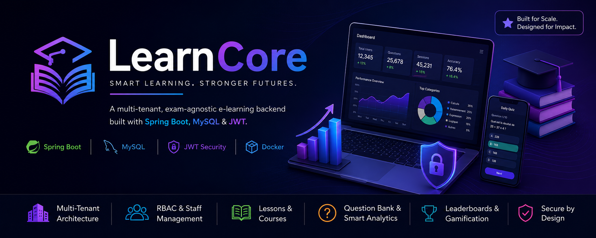

# LEARNCORE - Multi-tennant E-learning plateform



A multi-tenant project designed to be a universal backend infrastructure for multiple e-learning plateforms 
> **Images in this README:** keep `banner.png` 


## Requirements

- Java **21**
- Maven **3.9+**

## Run

```bash
mvn spring-boot:run
```

Default server: `http://localhost:8088`

### Single JAR (backend + Angular UI)

```bash
mvn clean package
java -jar target/learncore-0.0.1-SNAPSHOT.jar --spring.profiles.active=prod
```

- Builds the Angular app (`frontend/dist/velzon/browser`) and copies it into `classpath:/static` inside the JAR.
- Open **`http://localhost:8080/`** for the Angular app.
- REST APIs are at **`http://localhost:8080/api/v1`**; Swagger UI at **`http://localhost:8080/swagger-ui.html`**.

- Skip frontend build (API-only JAR): `mvn clean package -Dskip.npm=true`
- If Angular output folder changes, update the `copy-resources` directory in `pom.xml`.

### Angular dev server (hot reload)

From `frontend/`:

```bash
npm install
npm start
```

This runs `ng serve` with **`proxy.conf.json`**: `/api`, `/swagger-ui`, and `/v3` are proxied to `http://localhost:8080`. Start Spring Boot separately, then use the CLI URL (usually `http://localhost:4200`).

### Using the UI

1. Open `http://localhost:4200` while Spring Boot runs on `http://localhost:8088`.


## API

Base path: `/api/v1`

## Configuration

## Limits


## OpenAPI / Swagger UI

With springdoc on the classpath, after startup open:

- `http://localhost:8088/swagger-ui.html`  
  (or the redirect target shown in the console, e.g. `/swagger-ui/index.html`)

## Stack

- Spring Boot **4.0.x**
- springdoc-openapi **3.x** for API docs
- Mysql 8.x
- Lombok

## License

Add your license here if applicable.
